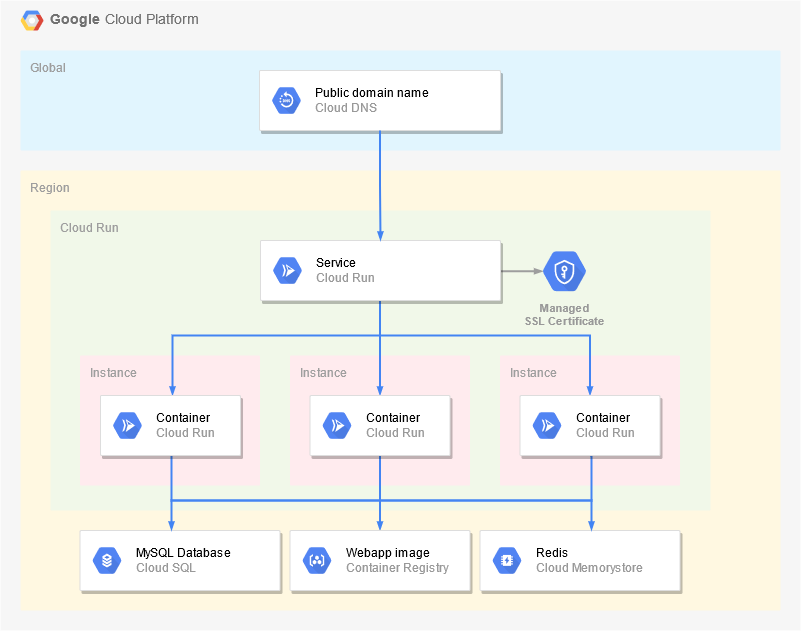

# Google Cloud Run

This example uses [Cloud Run](https://cloud.google.com/run) to run the Docker image and expose the service.

## Prerequisites

Before starting, follow the [Build](../build), [SQL](../sql) and [Secret Manager](../secret-manager) guides to create the container image, database and configuration.

## Using Cloud Console

Go to [Cloud Console](https://console.cloud.google.com) and make sure the appropriate project is selected in the header menu.

In the side menu, go to **IAM & Admin > Service Accounts**:
* Click **Create Service Account**.
* Set `karaplan` as the Service Account **name** and **ID**.
* Click **Create and continue**.
* Select the following **Roles**:
  * Secret Manager Secret Accessor
  * Cloud SQL Client
* Click **Done**.

In the side menu, go to **Cloud Run**:
* Click **Create service**.
* Enter the **Container image name**, e.g. `europe-west1-docker.pkg.dev/YOUR_PROJECT_ID/docker/karaplan:master`.
* Enter `karaplan` as the service **name**.
* Select your preferred **Region** (e.g. `europe-west1`).
* Configure the **maximum number of instances** (e.g. `5`).
* Select **Allow unauthenticated invocations**.
* Expand additional settings at the bottom.
  * In the **Container** tab, set **Memory** to `1 GiB`.
  * In the **Variables and secrets** tab, add a `SPRING_PROFILES_ACTIVE` **Environment variable** with value `gcp`.
  * In the **Security** tab, select the previously created `karaplan` **Service Account**.
* Click **Create**.

If you have a custom domain name:
* From the Cloud Run services list, click **Manage custom domains**.
* Click **Add mapping**.
* Select the `karaplan` service and **Cloud Run Domain Mappings**.
* Select your **verified domain** and enter the **subdomain** to use.
* Add the **CNAME record** to your domain as instructed.

After a few minutes, the application should become available at the generated service URL and/or at the custom domain name.

## Using Cloud Shell / SDK

Use the following commands in [Cloud Shell](https://cloud.google.com/shell/) or anywhere the [Cloud SDK](https://cloud.google.com/sdk/) is installed:

    # Set variables, adjust them as needed
    PROJECT_ID=$(gcloud config get-value project)
    REGION=$(gcloud config get-value compute/region)

    # Create Service Account and grant permissions
    gcloud iam service-accounts create karaplan
    gcloud projects add-iam-policy-binding $PROJECT_ID --member="serviceAccount:karaplan@$PROJECT_ID.iam.gserviceaccount.com" --role=roles/secretmanager.secretAccessor
    gcloud projects add-iam-policy-binding $PROJECT_ID --member="serviceAccount:karaplan@$PROJECT_ID.iam.gserviceaccount.com" --role=roles/cloudsql.client

    # Deploy Cloud Run service
    gcloud run deploy karaplan --image $REGION-docker.pkg.dev/$PROJECT_ID/docker/karaplan:master --cpu=1 --memory=1Gi --min-instances=0 --max-instances=5 --allow-unauthenticated --region=$REGION --service-account=karaplan@$PROJECT_ID.iam.gserviceaccount.com --set-env-vars="SPRING_PROFILES_ACTIVE=gcp"

If you have a custom domain name:

    DOMAIN=your.custom.domain

    # Create domain mapping
    gcloud run domain-mappings create --service=karaplan --domain=$DOMAIN --region=$REGION

    # Add the CNAME record to your domain as instructed.

After a few minutes, the application should become available at the generated service URL and/or at the custom domain name.

## Using Terraform

This directory contains a [Terraform](https://terraform.io) module to provision all resources automatically. See the `main.tf`, `variables.tf` and `outputs.tf` files for more information.

Please refer to the [Terraform Cloud Run Deployment](../../terraform/cloudrun) guide for a full example.

## Architecture diagram

