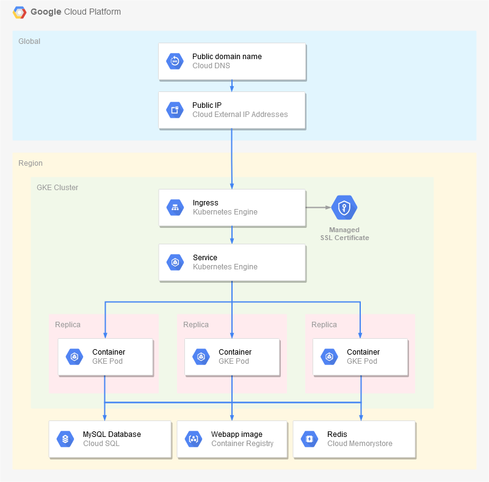

# Google Kubernetes Engine

This example uses [Kubernetes Engine](https://cloud.google.com/kubernetes-engine/) and [Helm](https://helm.sh) to run the Docker image in a Kubernetes cluster, and an Ingress to expose the service over HTTPS.

## Prerequisites

Before starting, follow the [Build](../build) and [SQL](../sql) guides to create the container image and database.

Then, download and install **Helm** from the official [releases](https://github.com/helm/helm/releases) page. If you are not going to use Terraform, update the `${...}` variables in the `values.yaml` file with appropriate values using your preferred editor. Refer to the deployment [README](../../README.md) file for information about configuring identity providers.

Finally, to expose the application over HTTPS, you will need to obtain a **domain name** in which you can create a **A record** pointing to a reserved IP address. If you don't have one, you may try using services from [sslip.io](https://sslip.io), [nip.io](https://nip.io) or [xip.io](http://xip.io).

## Using Cloud Console

Go to [Cloud Console](https://console.cloud.google.com) and make sure the appropriate project is selected in the header menu.

In the side menu, go to **Kubernetes Engine > Clusters** if you don't already have a Kubernetes Cluster:
* Click **Create cluster** and use Autopilot mode.
* Enter `karaplan-gke-cluster` as the cluster **name**.
* Select your preferred **Region** (e.g. `europe-west1`).
* Click **Create**.

In the side menu, go to **VPC network > External IP addresses**:
* Click **Reserve static address**.
* Enter `karaplan-gke-ip` as the address **name**.
* Select **Global** as the **type**.

If you have a custom domain name, add this IP address in a **A record**, then in the side menu go to **Network services > Load balancing**:
* At the bottom, click to the link to go to the **advanced menu**.
* In the **Certificates** tab, click **Create SSL certificate**.
* Enter `karaplan-gke-ssl-cert` as the certificate **name**.
* Check **Create Google-managed certificate**.
* Enter your custom domain name.
* Click **Create**.

For the rest of this guide, you will need to switch to **Cloud Shell / SDK** to perform additional commands (see below, *Deploy the application to Kubernetes*).

In the side menu, go to **Kubernetes Engine > Workloads** to monitor the deployment status. After several minutes, the application should become available at the reserved IP address and/or at the custom domain name.

## Using Cloud Shell / SDK

Use the following commands in [Cloud Shell](https://cloud.google.com/shell/) or anywhere the [Cloud SDK](https://cloud.google.com/sdk/) is installed:

    # Set variables, adjust them as needed
    PROJECT_ID=$(gcloud config get-value project)
    REGION=$(gcloud config get-value compute/region)
    NAMESPACE=default

    # Create GKE cluster, if necessary
    gcloud container clusters create-auto karaplan-gke-cluster --region=$REGION

    # Create IP address
    gcloud compute addresses create karaplan-gke-ip --global
    gcloud compute addresses list

    # Create service account and grant access to the SQL database
    gcloud iam service-accounts create karaplan
    gcloud projects add-iam-policy-binding $PROJECT_ID --member="serviceAccount:karaplan@$PROJECT_ID.iam.gserviceaccount.com" --role=roles/cloudsql.client

    # Configure Workload Identity
    gcloud iam service-accounts add-iam-policy-binding karaplan@$PROJECT_ID.iam.gserviceaccount.com --member="serviceAccount:$PROJECT_ID.svc.id.goog[$NAMESPACE/karaplan]" --role=roles/iam.workloadIdentityUser

If you have a custom domain name, add the created IP address in a **A record**, then:

    DOMAIN=your.custom.domain

    # Create SSL certificate
    gcloud compute ssl-certificates create karaplan-gke-ssl-cert --domains=$DOMAIN --global

If you are using **Cloud Shell**, you may use the 3-dots menu to upload the `values.yaml` file prepared in *Prerequisites* to your current session.

**Deploy** the application to Kubernetes:

    # Get Kubernetes cluster config
    gcloud container clusters get-credentials karaplan-gke-cluster --region=$REGION

    # Preview template before installing it
    helm template karaplan ../../helm/karaplan -f values.yaml

    # Install application
    helm upgrade -i karaplan ../../helm/karaplan -f values.yaml

After several minutes, the application should become available at the reserved IP address and/or at the custom domain name.

## Using Terraform

This directory contains a [Terraform](https://terraform.io) module to provision all resources automatically. See the `main.tf`, `variables.tf` and `outputs.tf` files for more information.

Please refer to the [Terraform GKE Deployment](../../terraform/gke) guide for a full example.

## Architecture diagram

